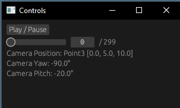

# The Vivo Toolkit (VivoTk)


### Rust version

Use Rust 1.58.1

### Coding Style

We follow the [official Rust coding style](https://github.com/rust-dev-tools/fmt-rfcs/blob/master/guide/guide.md).  You can use `rustfmt` (or run `cargo fmt`) to automatically format your code.

## Binaries

### `ply_to_pcd`

Converts ply files that are in Point_XYZRGBA format to pcd files

```shell
Converts ply files that are in Point_XYZRGBA format to pcd files

This assumes that the given ply files contain vertices and that the vertices are the first field in
the ply file.

USAGE:
    ply_to_pcd.exe [OPTIONS] --output-dir <OUTPUT_DIR> [FILES]...

ARGS:
    <FILES>...
            Files, glob patterns, directories

OPTIONS:
    -h, --help
            Print help information

    -o, --output-dir <OUTPUT_DIR>


    -s, --storage-type <STORAGE_TYPE>
            Storage type can be either "ascii" or "binary" [default: binary]
```

### Example

The following command will convert all `.ply` files in the `./plys/` directory to binary `.pcd` format and place them in `./converted_pcds/`.

```shell
ply_to_pcd -o ./converted_pcds -s binary ./plys/*
```

### `ply_play`

Plays a folder of pcd files in lexicographical order. A window will appear upon running the binary from which you can navigate using your mouse and keyboard. Controls are described further below.

```shell
Plays a folder of pcd files in lexicographical order

USAGE:
    ply_play.exe [OPTIONS] <DIRECTORY>

ARGS:
    <DIRECTORY>    Directory with all the pcd files in lexicographical order

OPTIONS:
    -b, --buffer-size <BUFFER_SIZE>    [default: 1]
        --controls
    -f, --fps <FPS>                    [default: 30]
    -h, --height <HEIGHT>              [default: 900]
        --help                         Print help information
        --pitch <CAMERA_PITCH>         [default: -20]
    -w, --width <WIDTH>                [default: 1600]
    -x, --camera-x <CAMERA_X>          [default: 0]
    -y, --camera-y <CAMERA_Y>          [default: 0]
        --yaw <CAMERA_YAW>             [default: -90]
    -z, --camera-z <CAMERA_Z>          [default: 0]
```

### Controls

With the main screen focused, 

1. `W` Key - Moves your position to the front
2. `A` Key - Moves your position to the left
3. `S` Key - Moves your position to the back
4. `D` Key - Moves your position to the right
5. 'Q' Key - Moves your position up
6. `E` Key - Moves your position down
7. `Space` Key - Toggles Play/Pause
8. `LeftArrow` Key - Rewinds by 1 frame
9. `RightArrow` Key - Advances by 1 frame
10. `Mouse` Drag - Adjusts camera yaw / pitch (Hold right click on Mac, left click on Windows)

With the secondary window focused,



The Play/Pause button toggles between play and pause. The slider allows you to navigate to any frame you wish.

The information displayed in the window are:

1. Current Frame / Total Frames
2. Camera Information - Useful to recreate a certain view through command line arguments

### Example

The following command will play all `.pcd` files in the `./pcds/` directory.

```shell
ply_play ./pcds
```

You can buffer the render with a set number of frames using `-b`

```shell
ply_play ./pcds -b 100
```

### `pcd_to_png`

Converts a folder of .pcd files to a folder of .png images

```shell
Converts a folder of .pcd files to a folder of .png images

USAGE:
    pcd_to_png.exe [OPTIONS] --pcds <PCDS> --output-dir <OUTPUT_DIR>

OPTIONS:
    -h, --height <HEIGHT>            [default: 900]
        --help                       Print help information
    -n, --frames <FRAMES>            Number of pcd files to convert
    -o, --output-dir <OUTPUT_DIR>    Directory to store output png images
        --pcds <PCDS>                Directory with all the pcd files in lexicographical order
        --pitch <CAMERA_PITCH>       [default: 0]
    -w, --width <WIDTH>              [default: 1600]
    -x, --camera-x <CAMERA_X>        [default: 0]
    -y, --camera-y <CAMERA_Y>        [default: 0]
        --yaw <CAMERA_YAW>           [default: -90]
    -z, --camera-z <CAMERA_Z>        [default: 1.3]
```

### Example

The following command will convert 20 `.pcd` files in `./pcds/` to `.png` images in `./pngs/`

```shell
pcd_to_png --pcds ./pcds/ -o ./pngs/ -n 20
```