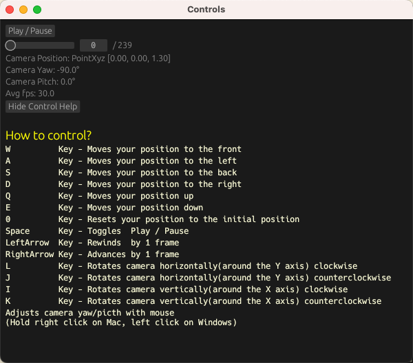

# VVTk: A Toolkit for Volumetric Video Researchers


## How to Install?

1. Install the latest Rust compiler from the [official website](https://www.rust-lang.org/tools/install)
2. Verify if `cargo` and `rustc` have been installed successfully using `cargo --version` and `rustc --version`
3. If you are using **linux**, make sure `gcc`, `g++`, `cmake`, `libssl-dev`, `pkg-config`, `libfontconfig1-dev` are installed
4. Compile and build the binaries with `cargo build --release --bins`
5. Install the binaries if you want to use it anywhere you want. `cargo install --path .`
6. Use `vv` and `vvplay` in other directory. Now you are good to go!
7. Download the [8i_dataset](https://plenodb.jpeg.org/pc/8ilabs/) to use and test our tool!

## Commands

### `vv`

Provides subcommands that can be chained together. The inputs and outputs of a subcommand must be specified with the `+input=` or `+in` followed by a comma separated list of inputs or `+output=` or `+out` to denote the name of its output stream. Note that `+input` must be specified for commands other than `read`.

```shell
Usage: vv <COMMAND>

Commands:
  convert     Converts a pointcloud file from one format to another.
                  Supported formats are .pcd and .ply.
                  Supported storage types are binary and ascii.
  write       Writes from input stream into a file, input stream can be pointcloud data or metrics
  read        Reads in one of our supported file formats. 
                  Files can be of the type .pcd .ply. 
                  The path can be a file path or a directory path contains these files.
  render      Writes point clouds from the input stream into images
  metrics     Calculates the metrics given two input streams.
                  First input stream is the original.
                  Second is the reconstructed.
                  Then uses write command to write the metrics into a text file.
  downsample  Downsample a pointcloud from the stream
  upsample    Upsamples a pointcloud from the stream
  normal      Performs normal estimation on point clouds.
  info        Get the info of a pointcloud file or directory.
                  Supported formats are .pcd and .ply.
                  If no option is specified, all info will be printed.
  dash        Dash will simulate a varying network conditions. 
                  Dash reads in one of our supported file formats. 
                  Files can be of the type .pcd .ply. 
                  The path can be a file path or a directory path contains these files.
  help        Print this message or the help of the given subcommand(s)

Options:
  -h, --help  Print help
```

***Example***

```shell
vv read ./ply_ascii +output=ply_a \
        write --output-format pcd --storage-type binary \
        ./pcd_binary +input=ply_a
```

Alternatively, you can use `+in` and `+out` as a shortcut to `+input` and `+output`.

```shell
vv read ./ply_ascii +out=ply_a \
        write --output-format pcd --storage-type binary \
        ./pcd_binary +in=ply_a
```

#### `read`

Reads in one of our supported file formats. Files can be of the type `.pcd` `.ply`. The path can be a file path or a directory path contains these files.

```shell
Usage: read [OPTIONS] [FILES]...

Arguments:
  [FILES]...  Files, glob patterns, directories

Options:
  -t, --filetype <FILETYPE>  [default: all] [possible values: all, ply, pcd]
  -n, --num <NUM>            read previous n files after sorting lexicalgraphically
  -h, --help                 Print help
```

```shell
vv read ./Ply +output=plys
```

Read only 10 files from a folder, specifying `--num` is useful to check the command is working as expected.

```shell
vv read ./Ply --num 10 +output=plys
```

#### `render`

Writes point clouds from the input stream into images(png) or videos(mp4).
To render point clouds into mp4, you need to make sure `ffmepg` is installed.

```shell
Usage: render [OPTIONS] <OUTPUT_DIR> 

Arguments:
  <OUTPUT_DIR>  Directory to store output png images

Options:
  -x, --camera-x <CAMERA_X>        [default: 0]
  -y, --camera-y <CAMERA_Y>        [default: 0]
  -z, --camera-z <CAMERA_Z>        [default: 1.8]
      --yaw <CAMERA_YAW>           [default: -90]
      --pitch <CAMERA_PITCH>       [default: 0]
      --width <WIDTH>              [default: 1600]
      --height <HEIGHT>            [default: 900]
      --name-length <NAME_LENGTH>  [default: 5]
      --bg-color <BG_COLOR>        [default: rgb(255,255,255)]
      --format <RENDER_FORMAT>     [default: png] [possible values: png, mp4]
      --fps <FPS>                  [default: 30]
      --verbose
  -h, --help                       Print help
```

***render to png example***

```shell
vv read ./Ply +output=plys \
        render ./Pngs +input=plys
```

***render to mp4 example***

Read 60 frames of pointcloud and render them into a mp4 video with fps=20. This is done by first render them into png files, and then use `ffmpeg` to convert the images into a mp4 video.

```shell
vv read -n 60 ./pcd +output=pcd \
    render ./mp4 \
    +input=f --format mp4 --fps 20
```

#### `metrics`

Calculates the metrics given two input streams where the first input stream is the original and the second is the reconstructed one. Then uses `write` command to write the metrics into a text file. Currently we support a number of commanly used metrics such as `ACD(Asymmetric Chamfer Distance)`, `CD(Chamfer Distance)`, `CD-PSNR`, `HD(Hausdorff Distance)`, `L-CPSNR(Luminance Color PSNR)`, `VQoE(Viola et al.’s QoE)`.
If no metric is specified, all metrics will be outputed.

```shell
Usage: metrics [OPTIONS]

Options:
  -m, --metrics <METRICS>...  [default: all] [possible values: acd, cd, cd-psnr, hd, lc-psnr, v-qoe, all]
  -h, --help             Print help
```

The following command will write all metrics.

```shell
vv read ./original +output=original \
        read ./reconstructed +output=reconstructed \
        metrics +input=original,reconstructed +output=metrics \
        write ./metrics +input=metrics
```

Specify the metrics by using --metrics, use space ',' as a delimiter for more than one metric.

```shell
vv read ./original +output=original \
        read ./reconstructed +output=reconstructed \
        metrics +input=original,reconstructed +output=metrics --metrics acd,cd,hd \
        write ./metrics +input=metrics
```

#### `write`

Writes from input stream into a file, input stream can be pointcloud data or metrics

```shell
Usage: write [OPTIONS] <OUTPUT_DIR>

Arguments:
  <OUTPUT_DIR>  output directory to store point cloud files or metrics

Options:
      --output-format <OUTPUT_FORMAT>  [default: pcd]
  -s, --storage-type <STORAGE_TYPE>    [default: binary]
      --name-length <NAME_LENGTH>      [default: 5]
  -h, --help                           Print help
```

***Writing metrics***

```shell
vv read ./original +output=original \
        read ./reconstructed +output=reconstructed \
        metrics +input=original,reconstructed +output=metrics \
        write ./metrics +input=metrics 
```

#### `upsample`

Upsamples a point cloud.

```shell
Usage: upsample --factor <FACTOR>

Options:
  -f, --factor <FACTOR>  
  -h, --help             Print help
```

***Upsampling a file***

Upsamples pcd files and write as ply binary

```shell
vv read ./pcd +output=pcdb \
       upsample --factor 2 +input=pcdb +output=pcdb_up \
       write ./pcd_up \
             +input=pcdb_up \
             --storage-type binary \
             --output-format ply
```

#### `downsample`

downsamples a point cloud.

```shell
Usage: downsample --points-per-voxel <POINTS_PER_VOXEL>

Options:
  -p, --points-per-voxel <POINTS_PER_VOXEL>  
  -h, --help 
```

***Downsampling a file***

Downsamples pcd files and write as ply binary

```shell
vv read ./pcd +output=pcdb \
       downsample -p 2 +input=pcdb +output=pcdb_down \
       write ./pcdb_down \
             +input=pcdb_down \
             --storage-type binary \
             --output-format ply
```

#### `normal`

Performs normal estimation on a point cloud.

```shell
Usage: normal --k <NUMBER_OF_NEIGHBORING_POINTS>
```

**Normal Estimation Example**

Performs normal estimation on ply files and write the computed normals back to the ply files.

```shell
.\vv read ".\Ply" +output=ply_a \
        normal --k 30 +input=ply_a +output=normal_a \
        write --output-format ply ./test +input=normal_a
```

**Complex Example**

```shell
vv read ./pcd                       +output=pcdb \
       read ./pcd_compressed            +output=pcd_comp \
       downsample -p 5 +input=pcdb      +output=pcdb_down \
       upsample   -f 2 +input=pcdb_down +output=pcdb_down_up \
       metrics +input=pcd_comp,pcdb_down_up +output=metric \
       write  ./metrics     +input=metric \
       write  ./down_up     +input=pcdb_down_up \
       render ./tmp/down_up +input=pcdb_down_up 
```

#### `convert`

We recognize that some users may just want to convert a file from one format to another. So `convert` is provided as a shortcut for `read` and `write`. Currently we support any conversion between ply and pcd. We also support converting files from velodyne's bin file to ply/pcd. For `convert`, named input-ouput is not needed.

```shell
Usage: convert [OPTIONS] --output <OUTPUT>

Options:
  -o, --output <OUTPUT>                
      --output-format <OUTPUT_FORMAT>  [default: pcd]
  -s, --storage-type <STORAGE_TYPE>    [default: binary]
  -i, --input <INPUT>                  
  -h, --help                           Print help
```

**convert** from ply to pcd(binary)

```shell
vv convert --input ./ply_a --output ./pcd_b
```

**convert** from pcd to ply(ascii)

```shell
vv convert --input ./pcd_b --output ./ply_a --storage-type ascii --output-format ply
```

**convert** from pcd(binary) to pcd(ascii)

```shell
vv convert --input ./pcd_b --output ./pcd_a --storage-type ascii --output-format pcd
```

#### `info`

Get the info of a pointcloud file or directory. Supported formats are .pcd and .ply. If no option is specified, all info will be printed.

```shell
Usage: info [OPTIONS] <PATH>

Arguments:
  <PATH>  

Options:
      --num-of-points  Get the number of points in a file
      --format         Get the format of a file
      --num-of-frames  Get the number of frames in a directory
  -h, --help           Print help
```

***Examples***  
**info** for a pointcloud file

```shell
vv info foo.ply
```

The encoding format(ascii or binary) of the file, the number of points will be printed.

```shell
format: pcd ASCII
number of points: 693899
```

**info** for a directory that contains pointcloud file

```shell
vv info ./longdress/Ply
```

The encoding format(ascii or binary) of the file in the directory, the number frames and the average of points will be printed.

```shell
format: pcd BINARY
number of frames: 240
average number of points: 728297.04
```

If more than one file format exists in the given directory, the summary of respective type will be printed.

```shell
vv info ./longdress/all_types
```

will output

```shell
format: pcd ASCII
number of frames: 2
average number of points: 688515.00

format: ply BINARY
number of frames: 2
average number of points: 649491.00

format: pcd BINARY
number of frames: 2
average number of points: 671719.00

format: ply ASCII
number of frames: 2
average number of points: 688515.00
```

#### `dash`

Dash will simulate a varying network conditions, it reads in one of our supported file formats.
Files can be of the type .pcd .ply.
The path can be a file path or a directory path contains these files.

```shell
Usage: dash [OPTIONS] <FILES>... +output=plys

Arguments:
  <INPUT_PATH>    input directory with different quality of point clouds
  <NETWORK_PATH>  path to network settings

Options:
  -a, --algorithm <ALGORITHM>  [default: naive] [possible values: naive, quetra]
  -n, --num <NUM>              read previous n files after sorting lexicalgraphically
  -t, --filetype <FILETYPE>    [default: all] [possible values: all, ply, pcd, bin]
  -h, --help                   Print help
```

***Preparation***  

An example of network setting file is provided in `./test_files/dash/sim_nw_avg_14050.txt`

The structure of input directory with different quality of point clouds should be the following.

```shell
INPUT_PATH
├── R01
│   ├── r1_longdress_dec_0000.pcd
│   ├── ***
│   └── r1_longdress_dec_0299.pcd
├── R02
│   ├── r2_longdress_dec_0000.pcd
│   ├── ***
│   └── r2_longdress_dec_0299.pcd
├── R03
│   ├── r3_longdress_dec_0000.pcd
│   ├── ***
│   └── r3_longdress_dec_0299.pcd
├── R04
│   ├── r4_longdress_dec_0000.pcd
│   ├── ***
│   └── r4_longdress_dec_0299.pcd
└── R05
    ├── r5_longdress_dec_0000.pcd
    ├── ***
    └── r5_longdress_dec_0299.pcd
```

***Usage***

```shell
vv dash ./input ./sim_nw_avg_14050.txt -a quetra +out=dash \
   write --output-format pcd --storage-type binary \
   ./pcd_quetra +in=dash
```

### `extend`

``extend`` can be used to run external subcommands that is in the form of executable. Read [docs/dev/extension.md](./docs/dev/extension.md) for more details. 

```sh
Extend is used for running custom subcommands.

Usage: extend [OPTIONS] <CMD_NAME>

Arguments:
  <CMD_NAME>  Command name of the extension without the vv-prefix

Options:
  -x, --xargs <XARGS>...  Arguments that needs to pass in to the binary executable, value separate by comma
  -h, --help              Print help
```

**Example:**  
Read a ply_ascii, pass to ``~/.cargo/bin/vv-test-executable`` then perform downsample. 
```
vv read ./test_files/ply_ascii/  +output=plyc \extend test-executable +input=plyc +output=plyd \downsample -p 2 +input=plyd
```

### `vvplay`

Plays a folder of pcd/ply/bin files in lexicographical order. A window will appear upon running the binary from which you can navigate using your mouse and keyboard. Controls are described further below.

```shell
Plays a folder of point cloud files in lexicographical order

Usage: vvplay [OPTIONS] <SRC>

Arguments:
  <SRC>  src can be: 1. Directory with all the pcd files in lexicographical order 2. location of the mpd file

Options:
  -q, --quality <QUALITY>            [default: 0]
  -f, --fps <FPS>                    [default: 30]
  -x, --camera-x <CAMERA_X>          [default: 0]
  -y, --camera-y <CAMERA_Y>          [default: 0]
  -z, --camera-z <CAMERA_Z>          [default: 1.3]
      --yaw <CAMERA_YAW>             [default: -90]
      --pitch <CAMERA_PITCH>         [default: 0]
  -W, --width <WIDTH>                [default: 1600]
  -H, --height <HEIGHT>              [default: 900]
      --controls                     
  -b, --buffer-size <BUFFER_SIZE>    
  -m, --metrics <METRICS>            
      --decoder <DECODER_TYPE>       [default: noop] [possible values: noop, draco]
      --decoder-path <DECODER_PATH>  
      --bg-color <BG_COLOR>          [default: rgb(255,255,255)]
  -h, --help                         Print help
```

### Controls

With the main screen focused,

1. `W` Key - Moves your position to the front
2. `A` Key - Moves your position to the left
3. `S` Key - Moves your position to the back
4. `D` Key - Moves your position to the right
5. `Q` Key - Moves your position up
6. `E` Key - Moves your position down
7. `0` Key - Resets your position to the initial position
8. `Space` Key - Toggles Play/Pause
9. `LeftArrow` Key - Rewinds by 1 frame
10. `RightArrow` Key - Advances by 1 frame
11. `Mouse` Drag - Adjusts camera yaw / pitch (Hold right click on Mac, left click on Windows)
12. `L` Key - Rotates camera horizontally(around the Y axis) clockwise
13. `J` Key - Rotates camera horizontally(around the Y axis) counterclockwise
14. `I` Key - Rotates camera vertically(around the X axis) clockwise
15. `K` Key - Rotates camera vertically(around the X axis) counterclockwise
16. Adjusts camera yaw/picth with mouse (Hold right click on Mac, left click on Windows)

With the secondary window focused,



The Play/Pause button toggles between play and pause. The slider allows you to navigate to any frame you wish.

The information displayed in the window are:

1. Current Frame / Total Frames
2. Camera Information - Useful to recreate a certain view through command line arguments

### Example

The following command will play all `.pcd` files in the `./pcds/` directory.

```shell
vvplay ./pcds
```

You can buffer the render with a set number of frames using `-b`

```shell
vvplay ./pcds -b 100
```

You can specify the background color using `--bg-color` in the following two ways.

1. use rgb value: rgb(r,g,b)
2. use hex rgb number: #RRGGBB

```shell
vvplay ./pcds --bg-color "#9ef244"
vvplay ./pcds --bg-color "rgb(10,23,189)"
```

## For Developers

### Rust version

Use Rust 1.69

### Coding Style

We follow the [official Rust coding style](https://github.com/rust-dev-tools/fmt-rfcs/blob/master/guide/guide.md).  You can use `rustfmt` (or run `cargo fmt`) to automatically format your code.
